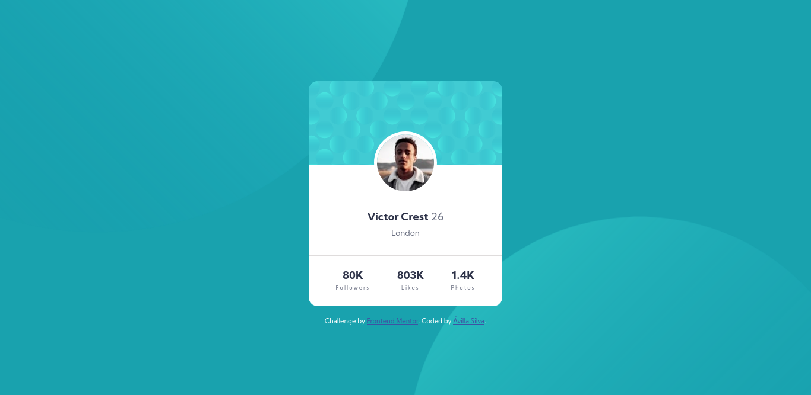
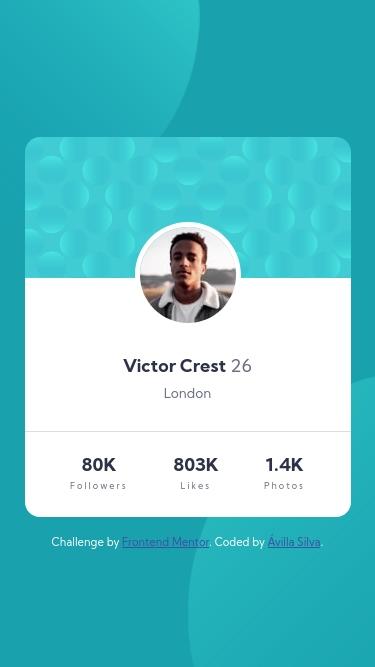

# Frontend Mentor - Stats preview card component solution

This is a solution to the [Profile card component](https://www.frontendmentor.io/challenges/profile-card-component-cfArpWshJ). Frontend Mentor challenges help you improve your coding skills by building realistic projects.

## Table of contents

-  [Overview](#overview)

-  [The challenge](#the-challenge)

-  [Screenshot](#screenshot)

-  [My process](#my-process)

-  [Built with](#built-with)

-  [What I learned](#what-i-learned)

-  [Continued development](#continued-development)

-  [Useful resources](#useful-resources)

-  [Author](#author)

## Overview

### The challenge

Users should be able to:

- View the optimal layout depending on their device's screen size

### Screenshot

Dekstop design:

<p align="center">
  
</p>

Mobile design:
<p align="center">
  
</p>

## My process

### Built with

- Flexbox

- Mobile-first workflow

### What I learned

One of the things I learned while working on the challenge was how to position the background images. I positioned the images using the following approach:

```html

<div  class="container">
    ...
</div>

```

```css
.container {
  background-color: hsl(185, 75%, 39%);
  background-image: url(images/bg-pattern-top.svg), url(images/bg-pattern-bottom.svg);
  
  /* I used pixels, but it's possible to use other units like percentages. */
  background-position: left -213px top -190px, right -250px bottom -200px;
  background-repeat: no-repeat;
  background-size: 110%, 120%;
}
```

### Continued development
  
I want to continue improving my skills in HTML and CSS, mainly with a focus on responsive web design and mobile first.

### Useful resources

-  [Controlling background-images | CSS Tutorial](https://www.youtube.com/watch?v=3T_Jy1CqH9k) - Where I learned how to position the images properly.

## Author

- Frontend Mentor - [@avillasilva](https://www.frontendmentor.io/profile/avillasilva)
